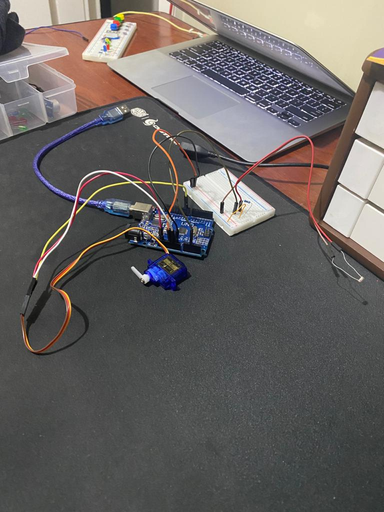

# Projeto de tempo extra testando Servo motor

A ideia deste projeto é ler pelo sensor de luz a tela do computador e conforme os obstáculos do jogo forem passando, o servo motor é acionado fazendo com que pressione a barra de espaço do teclado para pular.

jogo: [chrome://dino](chrome://dino)

link para meu vídeo do instagram: [link](https://www.instagram.com/p/COTqjLTDLNG/?igshid=pscd2yh0jyld)

#just4fun!

